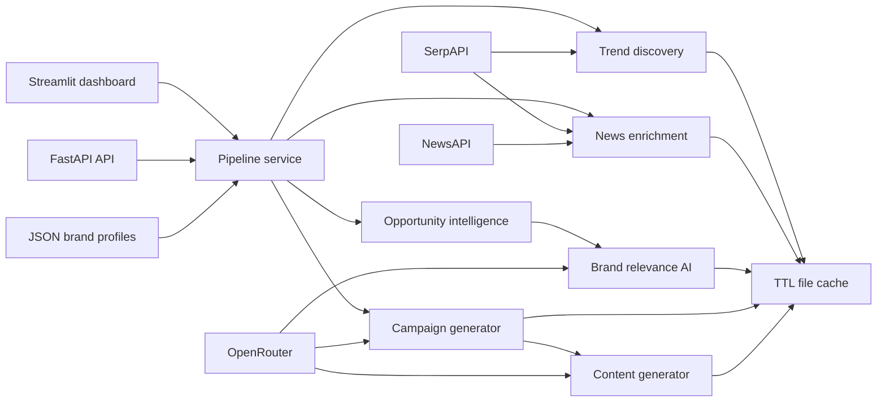

# NEWSJACK AI

**Discover trends. Find opportunities. Generate campaigns.**

NEWSJACK AI is an AI-powered marketing intelligence platform that discovers live trends, enriches them with news evidence, measures brand relevance, ranks newsjacking opportunities, and generates campaign strategy plus channel-ready content.

The application is designed to remain demonstrable without provider credentials: curated trends and deterministic generation fallbacks preserve the complete user journey, while SerpAPI, NewsAPI, and OpenRouter unlock live intelligence.

## Capabilities

- Persistent brand profiles with create, update, list, load, and delete operations
- Google Trends discovery through SerpAPI with a curated offline fallback
- Google News, Google Trends News, and NewsAPI enrichment
- Duplicate, spam, relevance, recency, importance, and credibility filtering
- Brand relevance, audience overlap, newsjack potential, and final opportunity scoring
- AI campaign angles, insights, recommended channels, and suggested content
- LinkedIn, X, and Instagram content with hooks, CTAs, and hashtags
- Competitor mention monitoring
- Plotly-ready analytics
- 30-minute local file cache
- Structured JSON logs
- FastAPI backend and six-page Streamlit dashboard

## Architecture



## Quick start

Python 3.11 or newer is recommended.

```powershell
python -m venv .venv
.\.venv\Scripts\Activate.ps1
pip install -r requirements.txt
Copy-Item .env.example .env
```

Add any available provider credentials to `.env`.

Start the API:

```powershell
uvicorn app.main:app --reload
```

Open API documentation at `http://127.0.0.1:8000/docs`.

Start the dashboard in another terminal:

```powershell
streamlit run app/streamlit_app.py
```

## Configuration

| Variable | Purpose | Default |
|---|---|---|
| `OPENROUTER_API_KEY` | AI relevance and generation | Offline fallback |
| `OPENROUTER_MODEL` | OpenRouter model identifier | `openai/gpt-4.1-mini` |
| `SERPAPI_KEY` | Live trends and Google News | Curated trends |
| `NEWS_API_KEY` | News enrichment and competitor monitoring | No NewsAPI results |
| `SERPAPI_GEO` | Trend geography | `IN` |
| `CACHE_TTL_SECONDS` | Provider response cache | `1800` |
| `MAX_TRENDS` | Trends per scan | `12` |
| `ENABLE_LLM_RELEVANCE` | Use an LLM during bulk ranking; disabled for fast scans | `false` |

Never commit `.env`; it is intentionally ignored.

## API

- `GET /health`
- `GET /api/trends`
- `GET/POST /api/brands`
- `GET/PUT/DELETE /api/brands/{profile_id}`
- `POST /api/opportunities`
- `POST /api/campaigns/generate`
- `POST /api/analytics`
- `POST /api/competitors`

## Scoring

The final opportunity score is an explainable weighted blend:

- Trend strength: 20%
- News volume: 10%
- Source diversity: 10%
- Brand relevance: 25%
- Audience overlap: 15%
- Newsjack potential: 20%

All component and final scores are clamped to 0–100.

## Tests

```powershell
pytest -q
```

The test suite mocks provider boundaries and runs without live API calls.

## Data and cache

Runtime data is created under `.newsjack/`:

- `brands/` contains JSON profile documents.
- `cache/` contains TTL-bound provider responses.

These files can be removed safely in development; the service recreates the directories.
