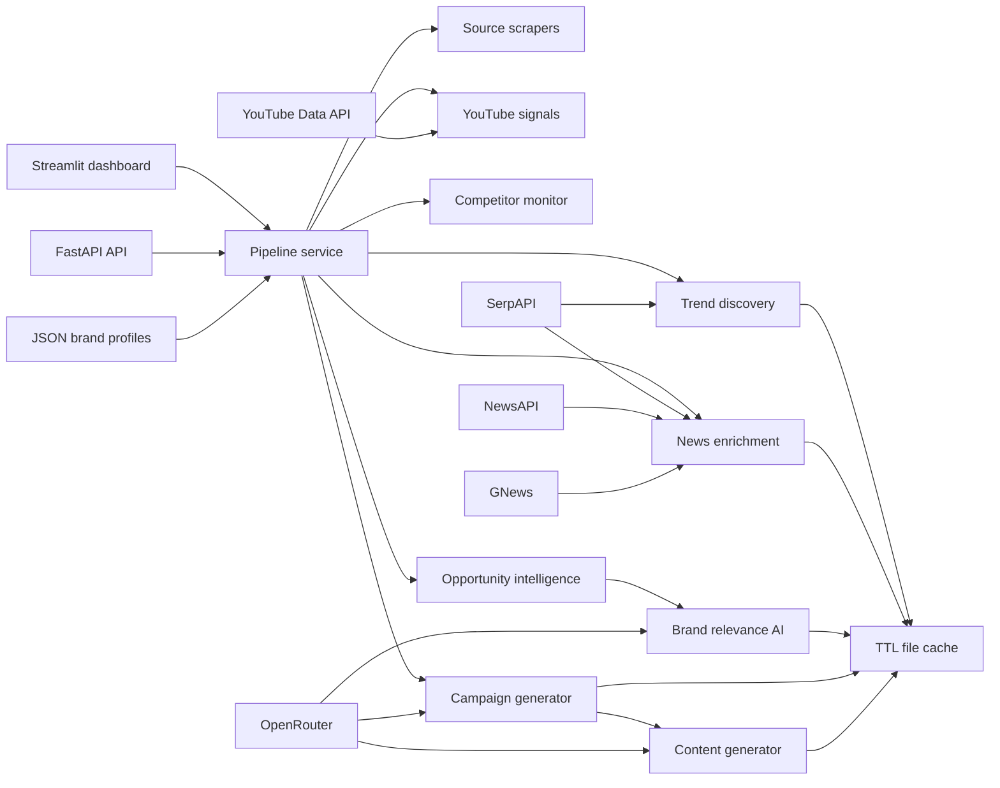

# NEWSJACK AI

**Discover trends. Find opportunities. Generate campaigns.**

NEWSJACK AI is an AI-powered marketing intelligence platform that discovers live trends, enriches them with news evidence, measures brand relevance, ranks newsjacking opportunities, and generates campaign strategy plus channel-ready content.

The application is designed to remain demonstrable without provider credentials: curated trends and deterministic generation fallbacks preserve the complete user journey, while SerpAPI, GNews, YouTube, NewsAPI, web scraping, and OpenRouter unlock live intelligence.

## Capabilities

- Persistent brand profiles with create, update, list, load, and delete operations
- MongoDB Atlas-backed brand profiles with local JSON fallback
- Google Trends discovery through SerpAPI with a curated offline fallback
- Brand-driven query expansion from profile, products, keywords, audience, and competitors
- GNews-first article collection with Google News and NewsAPI fallback
- YouTube search/buzz signal collection
- Web scraping for OpenAI, Google, NVIDIA, HubSpot, Marketing Brew, TechCrunch, and Product Hunt
- Duplicate, spam, relevance, recency, importance, and credibility filtering
- Component-level brand relevance across keywords, products, industry, audience, goals, and competitors
- v2.0 opportunity scoring across relevance, trend momentum, freshness, competitor activity, YouTube buzz, and volume
- AI campaign angles, insights, recommended channels, and suggested content
- LinkedIn, X, and Instagram content with hooks, CTAs, and hashtags
- Competitor mention monitoring
- Plotly-ready analytics
- 30-minute local file cache
- Structured JSON logs
- FastAPI backend and six-page Streamlit dashboard

## Architecture



## Quick start

Python 3.11 or newer is recommended.

```powershell
python -m venv .venv
.\.venv\Scripts\Activate.ps1
pip install -r requirements.txt
Copy-Item .env.example .env
```

Add any available provider credentials to `.env`.

Start the API:

```powershell
uvicorn app.main:app --reload
```

Open API documentation at `http://127.0.0.1:8000/docs`.

Start the dashboard in another terminal:

```powershell
streamlit run app/streamlit_app.py
```

## Configuration

| Variable | Purpose | Default |
|---|---|---|
| `OPENROUTER_API_KEY` | AI relevance and generation | Offline fallback |
| `OPENROUTER_MODEL` | OpenRouter model identifier | `openai/gpt-4.1-mini` |
| `NOTION_API_KEY` | Notion integration secret for the LinkedIn Scheduler | Notion disabled |
| `NOTION_PARENT_PAGE_ID` | Parent page where the scheduler database is created | Required unless database ID is set |
| `NOTION_LINKEDIN_DATABASE_ID` | Existing Notion scheduler database ID | Auto-create database |
| `LINKEDIN_CLIENT_ID` | LinkedIn app client ID for OAuth/token management | Empty |
| `LINKEDIN_CLIENT_SECRET` | LinkedIn app client secret for OAuth/token management | Empty |
| `LINKEDIN_REDIRECT_URI` | LinkedIn OAuth redirect URI | Empty |
| `LINKEDIN_ACCESS_TOKEN` | LinkedIn access token with organization posting permissions | LinkedIn posting disabled |
| `LINKEDIN_ORGANIZATION_URN` | Organization author URN, for example `urn:li:organization:123` | LinkedIn posting disabled |
| `SERPAPI_KEY` | Live trends and Google News | Curated trends |
| `GNEWS_API_KEY` | Primary brand-news and competitor source | Fallback providers |
| `NEWS_API_KEY` | Fallback news enrichment and competitor monitoring | No NewsAPI results |
| `YOUTUBE_API_KEY` | YouTube search and buzz signals | Empty YouTube signals |
| `MONGODB_ENABLED` | Store brand profiles in MongoDB Atlas | `false` |
| `MONGODB_URI` | MongoDB Atlas connection string | Local JSON fallback |
| `MONGODB_DATABASE` | MongoDB database name | `newsjack_ai` |
| `SERPAPI_GEO` | Trend geography | `IN` |
| `CACHE_TTL_SECONDS` | Provider response cache | `1800` |
| `TRENDS_CACHE_TTL_SECONDS` | Google Trends cache | `3600` |
| `NEWS_CACHE_TTL_SECONDS` | GNews/news cache | `1800` |
| `YOUTUBE_CACHE_TTL_SECONDS` | YouTube cache | `3600` |
| `SCRAPER_CACHE_TTL_SECONDS` | Scraper cache | `1800` |
| `COMPETITOR_CACHE_TTL_SECONDS` | Competitor monitoring cache | `1800` |
| `AI_CACHE_TTL_SECONDS` | AI output cache | `86400` |
| `MAX_TRENDS` | Trends per scan | `12` |
| `MAX_BRAND_QUERIES` | Brand-expanded queries per scan | `12` |
| `ENABLE_LLM_RELEVANCE` | Use an LLM during bulk ranking; disabled for fast scans | `false` |

Never commit `.env`; it is intentionally ignored.

## API

- `GET /health`
- `GET /api/trends`
- `GET/POST /api/brands`
- `GET/PUT/DELETE /api/brands/{profile_id}`
- `POST /api/opportunities`
- `POST /api/campaigns/generate`
- `POST /api/analytics`
- `POST /api/competitors`

## Scoring

The v2.0 final opportunity score is an explainable weighted blend:

- Brand relevance: 40%
- Google Trends momentum: 20%
- News freshness: 15%
- Competitor activity: 10%
- YouTube buzz: 10%
- Content volume: 5%

All component and final scores are clamped to 0–100.

## Tests

```powershell
pytest -q
```

The test suite mocks provider boundaries and runs without live API calls.

Live/manual scheduler smoke tests:

```powershell
python tests/test_notion_scheduler.py
python tests/test_publish_due_linkedin_posts.py
```

These tests print whether required environment variables are present, but never print secret values.

## Data and cache

Runtime data is created under `.newsjack/`:

- `brands/` contains JSON profile documents.
- `cache/` contains TTL-bound provider responses.

When `MONGODB_ENABLED=true`, brand profiles are saved to the `brand_profiles`
collection in MongoDB Atlas first. Local JSON remains as a development fallback.
Runtime cache files can be removed safely in development; the service recreates
the directories.

## Notion LinkedIn Scheduler Setup

The LinkedIn Scheduler creates a Notion database named `GamePulse AI LinkedIn Calendar`, generates 30 days of GamePulse AI LinkedIn drafts, pushes them to Notion, and lets you manage approval and scheduling status from Streamlit. Approved due posts can be published through LinkedIn's official Posts API. Selenium and browser automation are not used.

1. Create a Notion integration at `https://www.notion.so/my-integrations`.
2. Copy the integration secret and add it to `.env`:

```powershell
NOTION_API_KEY=secret_xxx
```

3. Create or choose a parent Notion page where the scheduler database should live.
4. Open that page in Notion, choose Share, and invite/share the page with your integration.
5. Copy the parent page ID from the Notion URL. It is the long UUID-like value near the end of the URL.
6. Add the parent page ID to `.env`:

```powershell
NOTION_PARENT_PAGE_ID=your_parent_page_id
```

7. If you already created the database and want NEWSJACK AI to reuse it, add:

```powershell
NOTION_LINKEDIN_DATABASE_ID=your_database_id
```

8. To enable official LinkedIn publishing, create/configure a LinkedIn app with organization posting access, then add:

```powershell
LINKEDIN_CLIENT_ID=your_client_id
LINKEDIN_CLIENT_SECRET=your_client_secret
LINKEDIN_REDIRECT_URI=your_redirect_uri
LINKEDIN_ACCESS_TOKEN=your_access_token
LINKEDIN_ORGANIZATION_URN=urn:li:organization:your_organization_id
```

Only Notion posts with `Approval = true`, `Status = Scheduled`, and a due date/time are published. Draft and unapproved posts are always refused by the service.

9. Install dependencies and run Streamlit:

```powershell
pip install -r requirements.txt
python -m streamlit run app/streamlit_app.py
```

10. Open the `LinkedIn Scheduler` page, then use `Connect Notion`, `Generate 30-Day Calendar`, `Push to Notion`, `Load from Notion`, and `Publish Due Posts`.

To test the Notion connection and push three sample posts:

```powershell
python tests/test_notion_scheduler.py
```

To publish due approved posts from Notion through the official LinkedIn API:

```powershell
python scripts/publish_due_linkedin_posts.py
python -m scripts.publish_due_linkedin_posts
```

Render Cron command:

```powershell
python scripts/publish_due_linkedin_posts.py
```

Render Cron schedule for 10 AM IST:

```text
30 4 * * *
```
